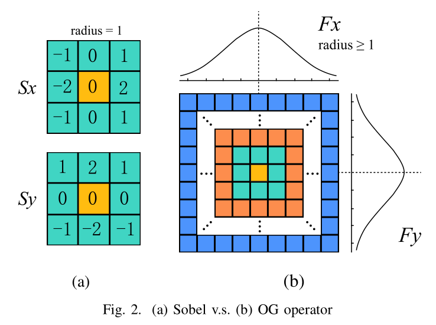
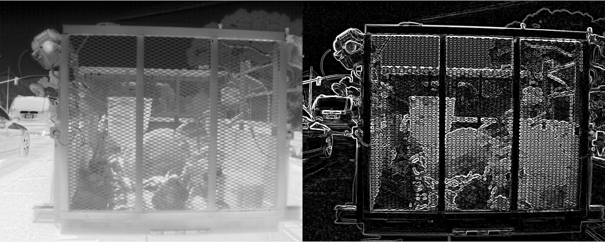
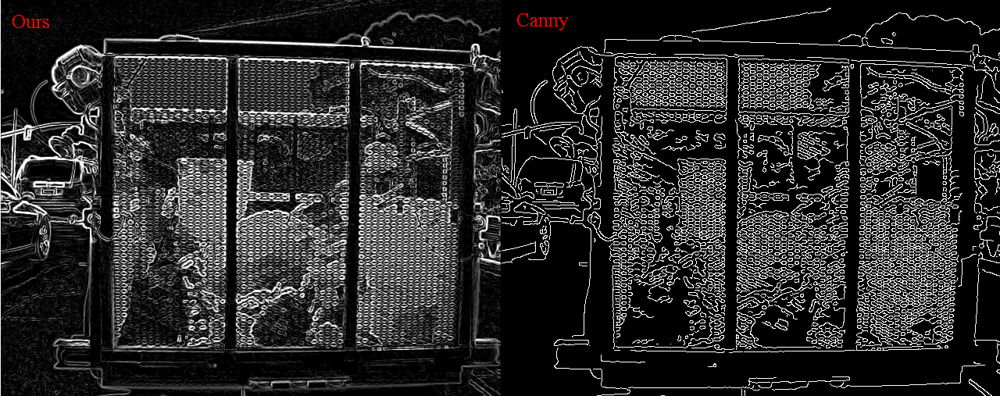

# Omnidirectional Gradient and Its Application in Stylized Edge Extraction of Infrared Image

> **After the article is officially published, all source code will be published.**

# Abstract

​	Gradient calculation is a low-level technique widely used in image processing. Where the gradient magnitude is large, the pixel value in the field changes greatly, and where the gradient magnitude is small, the pixel value in the field changes little. Traditional edge extraction algorithms are based on this, but usually need to manually set a magnitude threshold to distinguish. This paper innovatively bring out the concept of omnidirectional gradient, which uses flexible convolution kernel radius and special law to calculate, and omnidirectional gradient pay more attention to gradient direction and analyses the relationship and change of the gradient direction under different kernel radius. Based on the concept and features of omnidirectional gradient, we present an algorithm for stylized edge extraction, which overcomes the disadvantage of the existing classical edge extraction algorithms that require manual thresholding. Experimental results indicate that the proposed stylized edge extraction method outperforms the traditional edge extraction methods in terms of adaptive, consistency and more visually friendly for infrared images. Besides, the proposed algorithm is fast and has O(N) time complexity, its results can be used as the input for subsequent applications in real-time.

## Keywords

`omnidirectional gradient`, `stylized edge extraction`, `infrared image`


# What is Omnidirectional Gradient?

OG is calculated with flexible kernel radius $r$ and specific law of some function $f(i,j)$.




# Algorithm characteristics and effects

- Compute fast with $O(N)$ time complexity;
- The edge threshold is calculated adaptively, and it has good performance for infrared images with different signal strengths;
- The stylized edge is no longer a binary image. It is a grayscale image, which can reflect the signal intensity contrast, is more friendly to human vision, and retains more detailed information.

## Sample result of `seog` (this repo):



Compared to [Canny](https://en.wikipedia.org/wiki/Canny_edge_detector)：



# Key function

1) ## Calculate the OG operator

   `specialn` function of onion structure change law:

   ```matlab
   function [fx, fy] = fspecialn(r, fn)
   % Calculate the Omnidirectional Gradient operator at X/Y axises.
   % this is a simple special case of f(i,j), fn is changed related to n, n = max(|i|,|j|).
       arguments
           r int16                  % radius
           fn (1,:)  double         % decay function
       end
       % assert fn    
       assert(r>=1 && length(fn)==r);
       
       % calculate fx, fy without decay.    
       [x, y] = meshgrid(double(-r:r), double(-r:r));
       y = flipud(y); 
       fx = -x./(sqrt(x.^2+y.^2));
       fx(x==0 & y==0)=0;    
   
       fy = -y./(sqrt(x.^2+y.^2));
       fy(x==0 & y==0)=0;
       
       % apply decay factor according to fn and radius.
       if r>=1
           mf = zeros(2*r+1);
           for n = 1:r
               mf(max(abs(x), abs(y))==n)=fn(n);
           end
           fx = fx.*mf;
           fy = fy.*mf;
       end
   end
   ```

   another more flexible type `fspecialxy`:

   ```matlab
   function [fx, fy] = fspecialxy(r, fxy)
   % calculate the Omnidirectional Gradient operator at X/Y axises,
   % `fxy` is the decay factor mask matrix, with the size of (2*r+1)x(2*r+1).
       arguments
           r int16                      % radius
           fxy (:,:)  double         % decay function
       end
       % assert fxy
       [h, w] = size(fxy);
       assert(r>=1 && h==w && h==(2*r+1));
       
       % calculate fx, fy without decay.    
       [x, y] = meshgrid(double(-r:r), double(-r:r));
       y = flipud(y); 
       fx = -x./(sqrt(x.^2+y.^2));
       fx(x==0 & y==0)=0;    
   
       fy = -y./(sqrt(x.^2+y.^2));
       fy(x==0 & y==0)=0;
       
       % apply decay factor mask matrix according to fxy.
       fx = fx.*fxy;
       fy = fy.*fxy;
   end
   ```

   

2) ## Evaluate the lower threshold adaptively

   `estimate_lower_threshold` function declaration:

   > The source code will be published after the article is accepted.

   ```matlab
   function [lth, ep, low] = estimate_lower_threshold(Gr1, Gt1, Gt2, r, n)
   % Estimate the most reasonable lower threshold of `Gr1`.
   %
   % OUTPUTS:
   % - lth: Lower threshold value.
   % - ep: Edges percent
   % - low: Low noise image
       arguments
           Gr1  (:,:) double               % Magnitude of OG1
           Gt1  (:,:) double               % Angle of OG1, r=1.
           Gt2  (:,:) double               % Angle of OG2, r>=2
           r (1,1) double = 2            % radius of OG2, default is 2.
           n (1,1) double = 8           % Points smaller than n pixels are not considered
       end
   ```

   

3) ## Extract the stylized edge

   `stylized_edge_og` function declaration:

   > The source code will be published after the article is accepted.

   ```matlab
   function [seog, lth]  = stylized_edge_og(I, r, n)
   % Stylized edge extraction based on Omnidirectional Gradient .
   %
   % OUTPUTS:
   % - seog : The Stylized edge output based on OG
   % - lth : The lower threshold of Gr1
       arguments
           I (:,:)  double                        % Orignal image
           r (1,1) double                       % radius `r` according to Gt2
           n (1,1) double  = 16             % Minimum search step, default is 16
       end
   ```

   